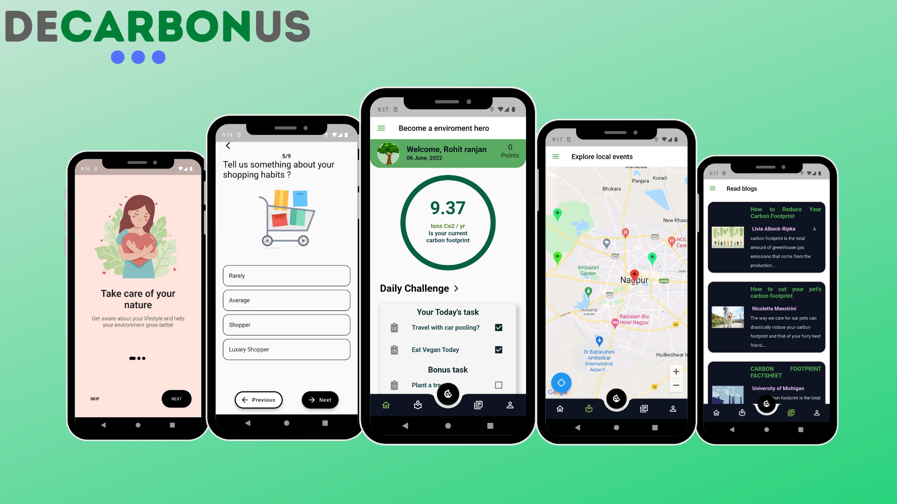

<h1 align="center">DeCarbonUs</h1>

<div align="center">
 
</div>

<br>

<a href="https://play.google.com/store/apps/details?id=com.rohitranjan.decarbonus&hl=en_IN&gl=US"></a>

[](https://flutter.dev/)
[](https://developers.google.com/maps/documentation)
[](https://dart.dev/)
[](https://cloud.google.com)
[](https://expressjs.com/)
[](https://nodejs.org/en/)

<p align="center">A <b>Google DSC Solution Challenge</b> submission</p>

<p align="center">DeCarbonUs is an App-based solution to help fight climate change by facilitating individuals to reduce and control their carbon footprint.
With our app, the user can easily monitor and analyze how their daily activities contribute to carbon emissions and how they can take measures to slowly reduce such contributing factors by taking simple steps</p>


### Video Submission

You can checkout our video submission demo on youtube by clicking on the thumbnail below.

<a href="https://youtu.be/dxp1GajblgU">
                                                                       
</a>

### This Project has been made targeting these UN Sustainable Goals


### Project Info
The contents in this repo follow the following structure, divided into two directories i.e one for app and one for api

```
├───carbon (REST API)
|   |───index.js
|   |───package-lock.json
|   |───package.json
|
├───decarbonus (FLUTTER APP)
   |-lib
     ├───screens
     ├───models
     ├───providers
     ├───resources
     ├───responsive
     ├───utils
     └───widgets
     ├───constant.dart
     ├───main.dart
     └───store.dart
     
```

### Description
 - Our solution mainly consists of a Flutter based mobile app. We wanted
   our solution to reach the masses, that's why we picked flutter as our
   framework of choice because of its cross-platform capabilities.
  
  - For the backend, we mostly relied on Firebase, for authentication and cloud storage
   
  - We have used our own REST API for calucalting the carbon footprint based upon user's data which is deployed on Google Cloud Platform.<br>

   
  - For storing the different types of data including user data like responses, results, posts, followers, bio, list of posts etc we have used Firestore database 
   
  - For verifying tht user with email & password as well as creating the use we have utilized the authentication feature of Firebase.
   
  - To show realtime location and events near the user's location we are using Google Maps API from GCP.
   
  - After the user has selected his reponses and he/she submits it, all the responses are collected and send to our REST API deployed on GCP, which in returns sends a average carbon foorprint emmsion value and it is stored in Firestore database
   
  - All the posts that the user makes through the naturegram feature in our app is stored in Firebase Storage

  - All the recent blogs shown in the app are also served thorugh the API Deployed on GCP.


## Setup

  #### Clone the repository
```bash
git clone https://github.com/Rohit-RA-2020/Solution-Challenge
```
  #### For start the API
```bash
cd \carbon
node i install
node index.js
```
#### API Deployed at :- https://api-account-345807.el.r.appspot.com 

  #### To run the app
```bash
cd \decarbonus
flutter pub get
flutter run
```
## Please Note
```bash
Goto android -> app -> src -> main -> AndroidManifest.xml

Replace The 'API_KEY_HERE' with your google maps api key to make sure G-Maps work properly.
```


## Made with ♥ by 

<p align="left">
<a href="https://www.linkedin.com/in/khushboo-agnihotri-4332a8195/"></a><a href="https://www.linkedin.com/in/romir-mathur17/"></a><a href="https://www.linkedin.com/in/yash-satankar-6b6a2719a/"></a><a href="https://www.linkedin.com/in/rohitranjan2020/"></a>
</p>
